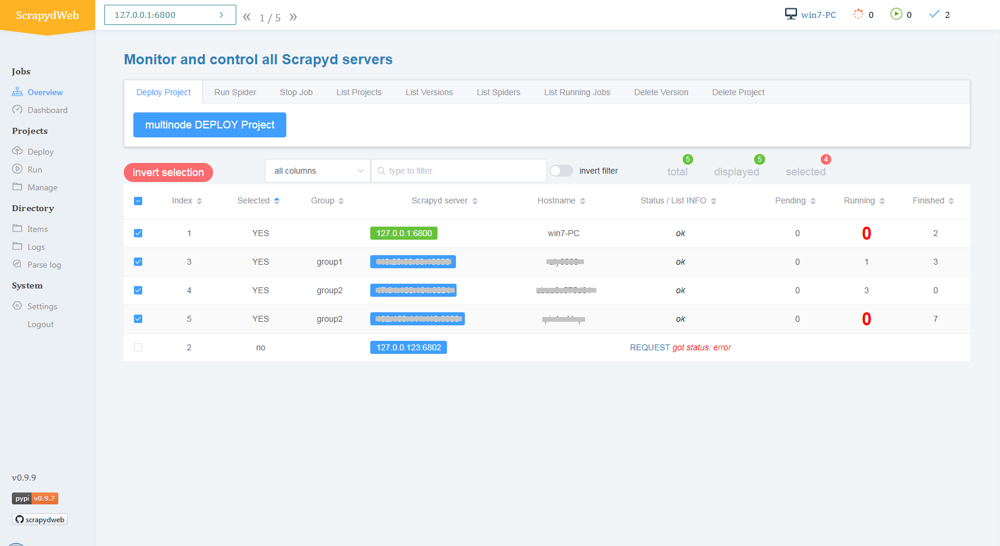

[English](./README.md) | 简体中文

# ScrapydWeb:  用于 Scrapyd 集群管理的全功能 web UI，支持 Scrapy 日志分析和可视化

[](https://pypi.org/project/scrapydweb/)
[](https://pepy.tech/project/scrapydweb)
[](https://pypi.org/project/scrapydweb/)
[](https://coveralls.io/github/my8100/scrapydweb?branch=master)
[](https://github.com/my8100/scrapydweb/blob/master/LICENSE)
[](https://twitter.com/intent/tweet?text=@my8100_%20ScrapydWeb:%20Full-featured%20web%20UI%20for%20Scrapyd%20cluster%20management,%20Scrapy%20log%20analysis%20%26%20visualization%20%23python%20%23scrapy%20%23scrapyd%20%23webscraping%20%23scrapydweb%20&url=https%3A%2F%2Fgithub.com%2Fmy8100%2Fscrapydweb)


## Scrapyd x ScrapydWeb
### 推荐阅读
[如何简单高效地部署和监控分布式爬虫项目](https://juejin.im/post/5bebc5fd6fb9a04a053f3a0e)




## 功能特性
- Scrapyd 集群管理
  - 支持通过分组和过滤来选择若干个节点
  - **一次操作, 批量执行**

- Scrapy 日志分析
  - 数据统计
  - **进度可视化**
  - 日志分类

- 支持所有 Scrapyd JSON API
  - Deploy project, Run Spider, Stop job
  - List projects/versions/spiders/running_jobs
  - Delete version/project

- 增强功能
  - web UI 支持基本身份认证
  - 后台预加载 Log 和 Stats 页面
  - **自动打包项目**
  - **邮件通知**
  - 移动端 UI


## 上手
### 环境要求
**请先确保所有主机都已经安装和启动 [Scrapyd](https://github.com/scrapy/scrapyd) 。**

如果需要远程访问 Scrapyd，则需将 Scrapyd 配置文件中的 [bind_address](https://scrapyd.readthedocs.io/en/latest/config.html#bind-address)
修改为 `bind_address = 0.0.0.0` ，然后重启 Scrapyd。

### 安装 ScrapydWeb
通过 pip:
```bash
pip install scrapydweb
```

通过 git:
```bash
git clone https://github.com/my8100/scrapydweb.git
cd scrapydweb
python setup.py install
```

### 启动 ScrapydWeb
1. 通过运行命令 `scrapydweb` 启动 ScrapydWeb
（第一次启动时将提示在生成的配置文件中添加 SCRAPYD_SERVERS）。
2. 访问 [http://127.0.0.1:5000](http://127.0.0.1:5000)
**（建议使用 Google Chrome 以获取最佳体验）**。

### 浏览器支持
最新版本的 Google Chrome，Firefox 和 Safari。


## 预览
- [界面截图](https://github.com/my8100/files/tree/master/scrapydweb/README.md)

- [动图演示](https://github.com/my8100/files/tree/master/scrapydweb/README_GIF.md)


## 执行测试
```bash
$ git clone https://github.com/my8100/scrapydweb.git
$ cd scrapydweb

# 创建虚拟环境
$ pip install virtualenv
$ virtualenv venv/scrapydweb
# 亦可指定 Python 解释器：$ virtualenv -p /usr/local/bin/python3.7 venv/scrapydweb
$ source venv/scrapydweb/bin/activate

# 安装依赖库
(scrapydweb) $ python setup.py install
(scrapydweb) $ pip install pytest
(scrapydweb) $ pip install coverage

# 请先确保已经安装和启动 Scrapyd，然后检查和更新 tests/conftest.py 文件中的 custom_settings
(scrapydweb) $ vi tests/conftest.py
(scrapydweb) $ curl http://127.0.0.1:6800

(scrapydweb) $ coverage run --source=scrapydweb -m pytest tests/test_a_factory.py -s -v
(scrapydweb) $ coverage run --source=scrapydweb -m pytest tests -s -vv
(scrapydweb) $ coverage report
# 生成 HTML 报告, 文件位于 htmlcov/index.html
(scrapydweb) $ coverage html
```


## 框架和依赖库
- 后端
  - [Flask](https://github.com/pallets/flask)
  - [Flask-Compress](https://pypi.org/project/Flask-Compress/)
  - [Requests](https://github.com/requests/requests)
- 前端
  - [jQuery](https://github.com/jquery/jquery)
  - [Vue.js](https://github.com/vuejs/vue)
  - [Element](https://github.com/ElemeFE/element)
  - [ECharts](https://github.com/apache/incubator-echarts)


## 更新日志
详见 [HISTORY.md](./HISTORY.md)。


## 作者
- [my8100](https://github.com/my8100)


## 贡献者
- [simplety](https://github.com/simplety)


## 软件许可
本项目采用 GNU General Public License v3.0 许可协议，详见 [LICENSE](./LICENSE)。
